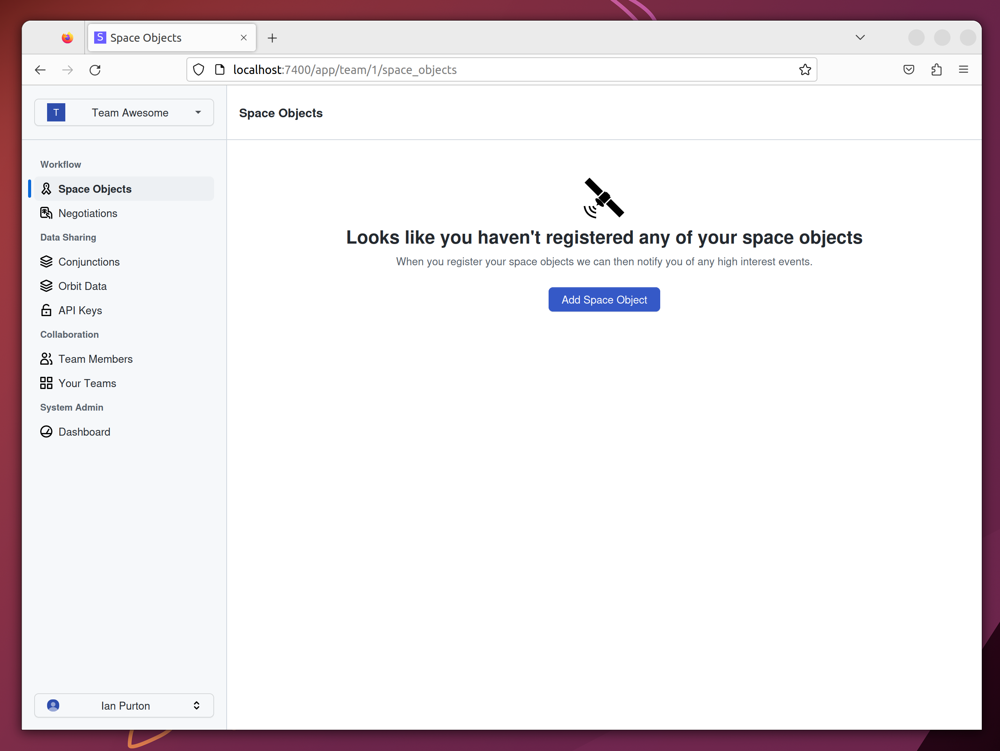

<h1 align="center">SkyTrace</h1>

 <strong>
   SkyTrace connects both parties during a conjunction and provides a secure workflow for collision avoidance. 
 </strong>

 

  <!-- License -->
  
  
  

 

  <h4>
    <a href="https://skytrace.space">
      Homepage
    </a>
  </h4>

 

## Development

SkyTrace uses the [Rust on Nails](https://rust-on-nails.com/) architecture for secure full stack web applications.