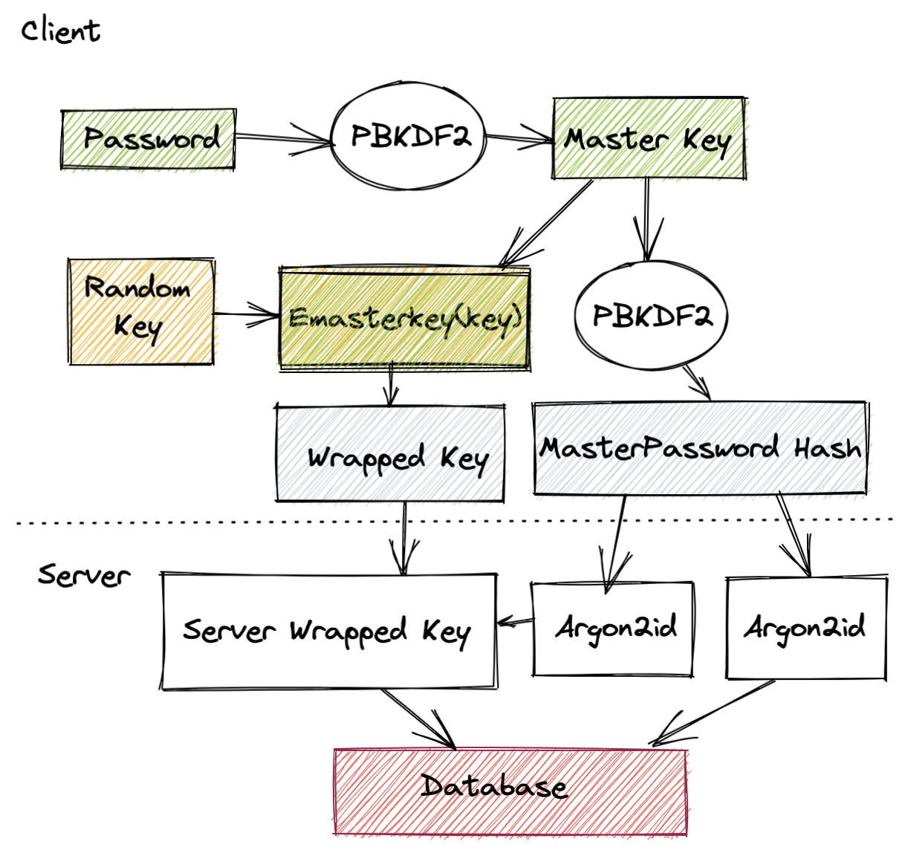

+++
title = "Encryption"
date = 2023-01-28
weight = 10
template = "docs-page.html"
+++

> The proper management of cryptographic keys is essential to the effective use of cryptography for security. Keys are analogous to the combination of a safe. If a safe combination is known to an adversary, the strongest safe provides no security against penetration. Similarly, poor key management may easily compromise strong algorithms. 

NIST Recommendation for Key Management

## Areas of Investigation for Key Management

We have a number of options of where the secret keys are stored and used.

### Managing web user keys on the server

This means we would sign data on behalf of the users. For example if a user submits a CDM we use a private key on the server to sign it. It's a similar process for encryption. The main advantage of this solution is that it is the easiest to implement and has no impact on the user. The disadvantage is that CREAM will sign all data making non repudiation very weak.

### Managing web user keys with a hardware device

This would probably bring the best security and allow the users complete control of their keys. However it would require creating bespoke firmware for an embedded device. Which would be an interesting project but probably out of scope for CREAM.

Examples of Hardware solutions that manage private keys for users are available in the Cryptocurreny space. In particular Trezor https://trezor.io/

### Managing web user keys in the browser

Many web applications with client-side encryption that use passwords derive both encryption and server authentication keys from them. Examples are:

- Bitwarden (https://www.bitwarden.com/)
- Lastpass (https://www.lastpass.com/de)
- Blockchain Crypto Currency (https://www.blockchain.com)

#### How does this in the browser?

In the **web browser** a master key is first derived from the given user **password**. The user email is used as cryptographic salt, i.e. used to increase the input entropy. PBDKF2 is a popular choice for this step.

User data encryption takes place using a randomly generated 64 byte symmetric key. After generation, this key is encrypted using the master key derived from the user password. The outcome of this process is called a "Wrapped key" (asymmetrically encrypted symmetric key). Finally, the master key is put into PBKFD2 with one iteration to generate a master password hash which is used to authenticate with the server.

#### How does this work on the server?

On the **server side** the master password hash and the wrapped key are received. The master password hash is again passed through a hashing algorithm on the server (using Argon2id) in a similar way a normal password would be stored to perform user authentication. The protected wrapped keys are also encrypted once more with a second Argon2id hash to ensure that the only way to recover the keys is to brute force the password. 

The server wrapped key is then stored in the database along with any public keys and the Argon2id output of the master password hash. 

#### Key Generation Process

### How to store Personal Identifiable Information (PII)

> STCREAM-1068 / STCREAM-1067 / R / F / UM User contact details (at least Email and Phone)

We also need to store users phone numbers which is PII. Encryption of PII information is a GDPR recommendation. This can be handled server side and we have several options to look at.

- A hardware security module. Basically encryption as a service but secured with tamper resistant hardware.
- Use encryption in the application. This does mean however importing encryption libraries into the main application.
- Hashicorp Vault. Runs as a docker container and provides encryption as a service. https://www.vaultproject.io/use-cases/data-encryption

## What do we need to look at?

- We need a proof of concept for using registration and signup using keys derived form a users password.
- A proof of concept for PII storage. i.e. Hashicorp Vault

## Derived Technical Requirements

1. The CREAM system shall encrypt PII information before it is passed to the database for storage. *STCREAM-1068*
1. The CREAM system shall derive keys using a key exchange technique for messages that are passed between users during a negotiation. *STCREAM-1665*
1. The CREAM should validate the signatures of all messages that have been signed. *STCREAM-1057* 

