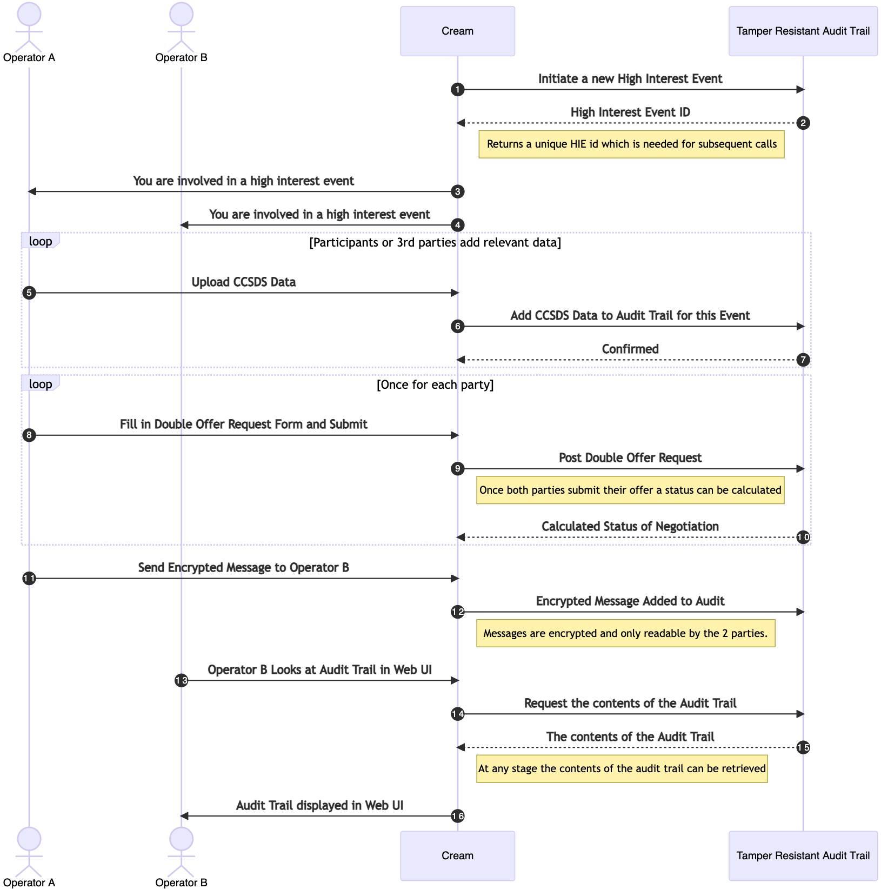
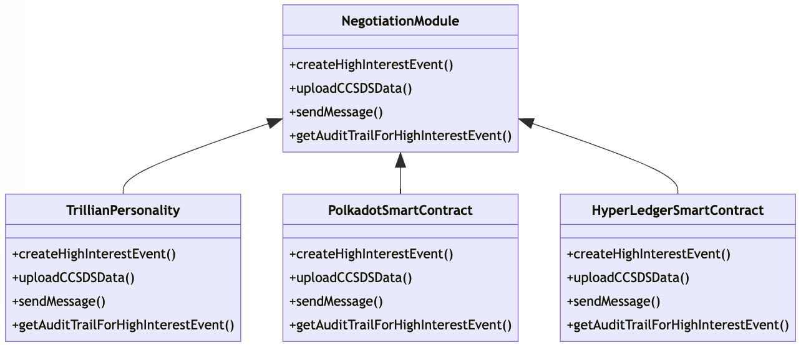

+++
title = "Tamper Resistance"
date = 2023-01-28
weight = 30
template = "docs-page.html"
+++

## Related Requirements

**STCREAM-1631 / - / T / F / MN**
All actions performed as part of a conjunction negotiation phase shall be auditable/traceable. Examples of actions:
- Uploading of new data
- Proposal of collision avoidance manoeuvre
- Acknowledgement of collision avoidance manoeuvre
- Announcement of collision avoidance manoeuvre execution time
- Success state of collision avoidance manoeuvre
- Opening of delta negotiation
- Closure of delta negotiation

**STCREAM-1090/ /R/A/MN**
The software shall allow the outcome of a negotiation to be computed, and the result stored in an immutable way

**STCREAM-1055 / - / Y / R / F / DP**
Data integrity (tamper-resistance), e.g. using Merkle trees or similar technologies, shall be provided for HIE conjunction audit trails

## Areas of Investigation

### The properties of DLT, Blockchain and Smart Contracts

#### Database Immutability and Tamper Resistance

> Immutable databases are centralized database systems where information is stored in a way that its integrity can be cryptographically verified. Every data change is tracked, and the complete history of changes are maintained so that the “integrity of the database” can be verified over time.

Tamper resistance only works if multiple parties have access to the database either in real time or via regular backups. Otherwise it would be possible to re-write the history of the database which defeats the purpose of immutability.

#### Non repudiation

> Digital signatures in blockchain systems use asymmetric encryption techniques that are typical of elliptic curve equations to guarantee the non- repudiation of information. For example, a digital signature for Bitcoin is achieved by using elliptic curves and modular arithmetic in finite fields

By adding digital signatures to data stored in a negotiation database we would be able to give certain guarantees that the steps taken in a negotiation where agreed by both parties. These signatures would need to come from those parties for an end to end trusted system.

#### Verification or how to we Audit

A Tamper resistant database needs to be verifiable. Clients and auditors want cryptographic proof of data inclusion and historical consistency in real or near real time.

If tampered, clients and auditors will notice that and take actions.

#### Smart Contracts

Smart contracts are algorithms that are stored along with the data. As data is added to the database the smart contract can be invoked. As the algorithm is also stored in the immutable database it is possible to prove that the algorithm and the data at a certain point in time gave the correct results.

In our case, anyone with a backup of the database or access to the database would be able to prove the results of a negotiation algorithm as well as verify the code that executed at any point in time.

Smart Contracts are usually stored in a bytecode format to save space. To check which algorithm was running at anyone time you need to compile the algorithm from source using the same compiler version and check the results match.

#### Distributed Database

> A distributed database (DDB) is an integrated collection of databases that is physically distributed across sites in a computer network.

Distribution helps us with 2 main issues

- It backups up the database in real time.
- It strengthens the tamper resistance as it makes it very difficult for any party to create a fake sequence of events as all parties have a copy of the database.

### Applicability to Negotiations

The more DLT technology we use the more we can prove we are acting honestly. However there is a trade off in terms of complexity and the learning curve is steep.

From the requirements we are able to come up with a simple interface which we can then build into Proofs of Concepts for DLT technology.

### Outline of a negotiation module



### Possible gRPC Interface for a Negotiation Module

From the sequence of events in a negotiation we came up with the following interface. Here represented in gRPC.

 ```proto
service NegotiationModule {
    rpc StartHighInterestEvent(HIERequest) returns (HIEResponse) {}
    rpc UploadCCSDSDataTOHighInterestEvent(CCSDSDataRequest) returns (CCSDSDataResponse) {}
    rpc SendSecretMessasge(MessageRequest) returns (MessageResponse) {}
    rpc AddDoubleOffer(DoubleOfferRequest) returns (NegotiationStatusResponse) {}
    rpc RequestDeltaNegotiation(DeltaNegotiationRequest) returns (NegotiationStatusResponse) {}
}
 ```

### Plugable Negotiation Modules

We can implement this common interface for different types of DLT. This gives us 2 benefits.

- The CREAM system does not need to care about implementation details.
- It leaves a path for adding alternative negotiation algorithms in the future.



## Possible Candidate DLT solutions

### Solutions without Smart Contracts

#### Trillian

- https://github.com/google/trillian 

A transparent, highly scalable and cryptographically verifiable data store.

#### ImmuDB

- ImmuDB https://codenotary.com/technologies/immudb/

An immutable database. Data is never overwritten so multiple versions of the same key co-exist and are verifiable.

### Smart Contract solutions

#### Ledger Fabric

- https://www.hyperledger.org/use/fabric

A private blockchain. Which means each Party that wishes to be a validator needs to install and run their own ledger and be invited into the quorum.

#### Polkadot 

- https://polkadot.network/

A public Blockchain with Smart Contract Support. This is effectively a managed solution. You can create contracts on the network without running your own infrastructure.

## What do we need to look at?

- Can we really use one interface for different types of DLT solutions.
- A Trillian proof of concept.
- An ImmuDB proof of concept.
- A PoC for a Blockchain that supports Smart Contracts.

## Derived Technical Requirements

1. At shall be possible for an independent third party to verify the integrity of the database. Remark this can be done through backups that can distributed to 3rd parties or through a distributed database where 3rd parties are in sync with the database.
